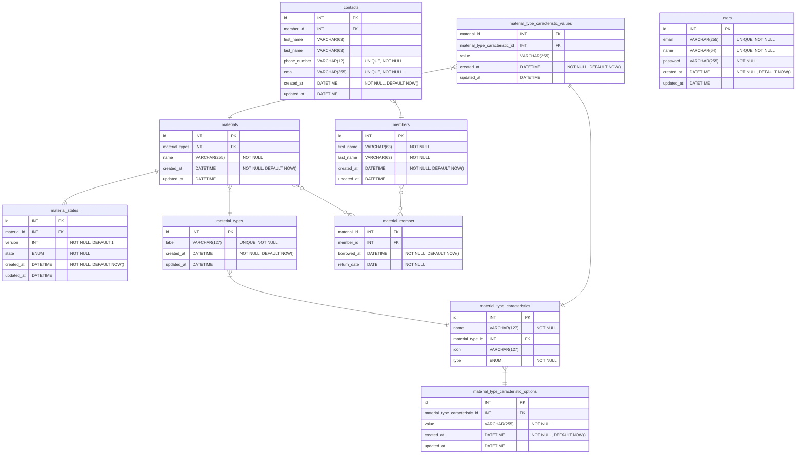

```mermaid
erDiagram
    contacts }|--|| members: ""
    materials ||--|{ material_states: "" 
    materials }|--|| material_types: ""
    materials }o--o{ material_member: ""
    members }o--o{ material_member: ""
    material_types }|--|| material_type_caracteristics: ""
    material_type_caracteristics }|--|| material_type_caracteristic_options: ""
    material_type_caracteristic_values ||--|| material_type_caracteristics: ""
    material_type_caracteristic_values  }|--|| materials:""
   users {
    id INT PK
    email VARCHAR(255) "UNIQUE, NOT NULL"
    name VARCHAR(64) "UNIQUE, NOT NULL"
    password VARCHAR(255) "NOT NULL"
    created_at DATETIME "NOT NULL, DEFAULT NOW()"
    updated_at DATETIME
   }
   contacts {
    id INT PK
    member_id INT FK
    first_name VARCHAR(63)
    last_name VARCHAR(63)
    phone_number VARCHAR(12) "UNIQUE, NOT NULL"
    email VARCHAR(255) "UNIQUE, NOT NULL"
    created_at DATETIME "NOT NULL, DEFAULT NOW()"
    updated_at DATETIME
   }
   members {
    id INT PK
    first_name VARCHAR(63) "NOT NULL"
    last_name VARCHAR(63) "NOT NULL"
    created_at DATETIME "NOT NULL, DEFAULT NOW()"
    updated_at DATETIME
   }
   materials {
    id INT PK
    material_types INT FK
    name VARCHAR(255) "NOT NULL"
    created_at DATETIME "NOT NULL, DEFAULT NOW()"
    updated_at DATETIME
   }
   material_states {
    id INT PK
    material_id INT FK
    version INT "NOT NULL, DEFAULT 1"
    state ENUM "NOT NULL"
    created_at DATETIME "NOT NULL, DEFAULT NOW()"
    updated_at DATETIME
   }
   material_types {
    id INT PK
    label VARCHAR(127) "UNIQUE, NOT NULL"
    created_at DATETIME "NOT NULL, DEFAULT NOW()"
    updated_at DATETIME
   }
   material_member {
    material_id INT FK
    member_id INT FK
    borrowed_at DATETIME "NOT NULL, DEFAULT NOW()"
    return_date DATE "NOT NULL" 
   }
   material_type_caracteristics {
    id INT PK
    name VARCHAR(127) "NOT NULL"
    material_type_id INT FK
    icon VARCHAR(127)
    type ENUM "NOT NULL"
   }
   material_type_caracteristic_options {
    id INT PK
    material_type_caracteristic_id INT FK
    value VARCHAR(255) "NOT NULL"
    created_at DATETIME "NOT NULL, DEFAULT NOW()"
    updated_at DATETIME
   }
   material_type_caracteristic_values {
    material_id INT FK
    material_type_caracteristic_id INT FK
    value VARCHAR(255)
    created_at DATETIME "NOT NULL, DEFAULT NOW()"
    updated_at DATETIME
   }
```
